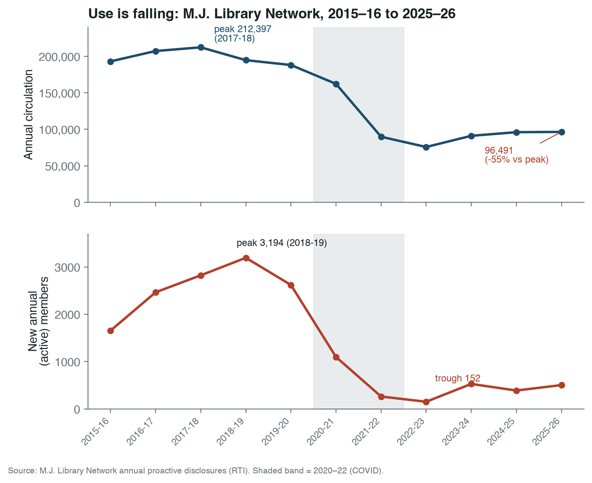
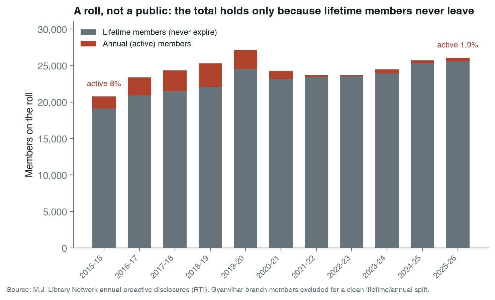
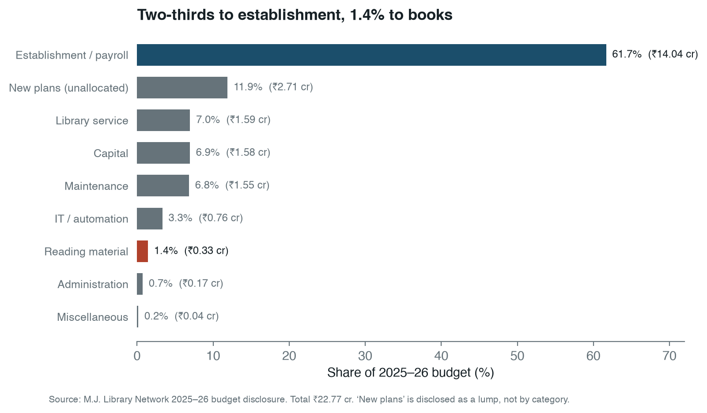
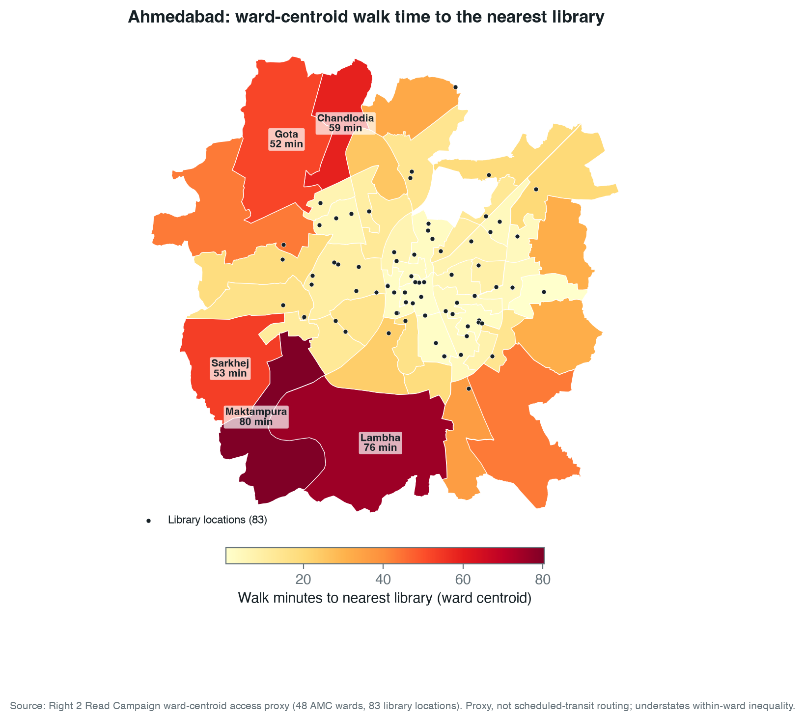

## Abstract

We compare the Ahmedabad Public Library / M.J. Library Network with the Toronto
Public Library on standardized IFLA Library Map of the World indicators — service
points, collections, registered users, visits, loans, and finance — each
normalized by population. The two systems disclose unequally. Ahmedabad publishes
a decade of annual operations and finance tables and a new ward-centroid
walk-access proxy; Toronto publishes current branch locations, square footage,
visits, borrowing, registrations, and finance, but median-resident travel time is
not yet computed.

The central finding is internal to Ahmedabad: its public use is not low and
stable, it is falling. Annual circulation fell 55 percent, from 212,397 in 2017-18
to 96,491 in 2025-26. New annual members fell 84 percent, from 3,194 in 2018-19 to
505 in 2025-26. The reported total of 26,834 members is nearly flat across the
decade only because 95 percent of it is a lifetime roll that never expires; the
active share is below 2 percent. On the one cleanly matched indicator, Toronto
lends about 735 times more per resident (10.02 against 0.014 borrowings). We use
Toronto as a disclosure standard, not a fairness benchmark: even at Toronto's far
higher per-resident spending, the use gap is several times the spending gap, so
funding levels alone do not explain Ahmedabad's decline. A budget that allocates
61.7 percent to establishment and 1.4 percent to materials explains more of it.

## Literature Review and Conceptual Frame

A public library is not a list of buildings, so a branch count can make a weak
system look healthy. The measurement literature separates inputs (collections,
staff, spending), outputs (visits, loans, registrations), and outcomes (use,
access, inclusion). The IFLA Library Map of the World, built on ISO 2789
definitions, gives the indicator grammar we use: service points, registered
users, visits, physical and digital loans, staff, internet access, and
collections, all comparable per population [@iflaLibraryMapData; @iso2789]. ISO
11620 adds the performance question — not how much a library owns, but how well
its resources convert into use [@iso11620]. That distinction organizes this paper.
The library is best read as civic infrastructure, not a book warehouse —
provisioned, sited, and judged like other urban systems [@mattern2014]. Ahmedabad's
collection disclosure is strong; its use is not.

The normative baseline is shared. The IFLA-UNESCO Public Library Manifesto frames
the public library as a local institution for education, information, and civic
life [@iflaManifesto2022], close to Ranganathan's user-centred laws: books are for
use, every reader their book, every book its reader, save the reader's time
[@ranganathan1931]. Both make circulation, visits, hours, and collection renewal
the primary measures. The urban-sociology literature explains why use, not stock,
is the test: libraries work as low-threshold public space and social
infrastructure, anchoring everyday public life beyond lending [@oldenburg1989;
@audunson2005; @klinenberg2018], though the link to trust and social capital must
be shown, not assumed [@goulding2004; @varheim2008]. In the Indian debate the same
point recurs as a politics of neglect: the public library is named a bedrock of
democratic and anti-caste life [@liangGupta2024] yet left under-resourced by the
states that own it [@chitralekha2014; @pyati2009], inside cities where elected
municipal bodies hold limited control [@mehta2016]. And "access" is not the end of
the argument — a library can be nominally available and still go unused, or remain
exclusionary in practice [@mickiewicz2016].

Access is not distance. Penchansky and Thomas distinguish availability,
accessibility, accommodation, affordability, and acceptability [@penchansky1981];
spatial-accessibility work shows a defensible model needs demand origins, supply
capacity, travel time, catchments, and distance decay, not nearest-facility
distance alone [@guagliardo2004; @luoWang2003; @luoQi2009]; the nearest-facility
assumption that simpler proxies rest on is itself only an approximation of how
people travel [@nisar2018]. We therefore read the Ahmedabad ward-centroid walk
model as a first diagnostic, not an accessibility finding. On where a library
should go, the IFLA service guidelines are explicit: service points belong where
people already converge, with branch, deposit, and mobile service tiered outward so
that everyone in the area is reached [@iflaServiceGuidelines2010]. In the Indian
policy context [@nationalKnowledgeCommission2007], the binding constraint on
comparison is municipal disclosure; Ahmedabad is unusual in disclosing a
decade-long series at all, which is what lets us measure decline rather than infer
it.

We carry five measurement rules into the analysis: normalize by population;
separate service points from effective capacity; treat public funding as an input,
not a result; read user fees as a possible barrier even when fiscally minor; and
keep spatial access as a proxy until travel-time routing is built.

## Data and Methods

The unit of analysis is the municipal public-library system, not a flagship
branch. Ahmedabad is the **Ahmedabad Public Library / M.J. Library Network**;
"M.J. Library" denotes only the flagship.

We build the comparison from each system's own disclosures, normalized to common
units. For Ahmedabad we use the M.J. Network's annual proactive (RTI) disclosures,
2015-16 to 2025-26, for collections, membership, and circulation, and its annual
budget disclosures for finance. For Toronto we use the city's open-data branch
file, the 2024 published key facts, and the 2026 library finance page. We convert
counts to per-resident or per-100,000-resident rates with a fixed population
denominator for each city — Ahmedabad 7,078,533 (2020 ward population), Toronto
2,794,356 (2021 census) — stated here so readers can rescale.

We separate matched from partial indicators. A matched indicator is one both
systems report on a comparable basis. A partial indicator is reported by one
system, or on bases too different to divide; we keep it to mark a gap, not to form
a ratio. Where a ratio would pair non-comparable objects, we report "not
comparable" rather than a number. Finance years differ (Ahmedabad 2025-26, Toronto
2026) because we use each system's latest locally normalized values; this moves
levels, not orders of magnitude. The Ahmedabad spatial-access measure is a
ward-centroid, population-weighted walk-time proxy over 48 wards and 83 geocoded
locations; it is not scheduled-transit routing and understates within-ward
inequality. Toronto's matching median-resident routing is not yet computed.

All figures are produced from these source tables by
`scripts/make_library_paper_figures.py`. The full source inventory is in the
appendix.

## Results: System Denominators

| Measure | Ahmedabad Public Library / M.J. Library Network | Toronto Public Library |
|---|---:|---:|
| Population denominator | 7,078,533 | 2,794,356 |
| Denominator year | 2020 ward population | 2021 census |
| Service points | 83 geocoded locations | 102 branches/bookmobiles |
| Coordinate-verified records | 83 | 101 |
| Collection items | 811,093 | at least 10,500,000 |
| Latest operations year used | 2025-26 | 2024 |
| Latest finance year used | 2025-26 | 2026 |

The Toronto denominator is deliberately conservative for this draft. It uses the
2021 City of Toronto census population because that value is stable and sourceable
inside the current work. If Toronto's 2026 population is higher, Toronto's
per-resident library metrics will fall, but not enough to change the order of
magnitude gap reported below.

Ahmedabad's denominator is the Right 2 Read Campaign ward-population total used in the
Ahmedabad library access model. It is also not a 2026 population estimate, so the
same caution applies in the other direction.

## Results: IFLA-Aligned Indicators

| Indicator | Ahmedabad | Toronto | Toronto/Ahmedabad | Comparability |
|---|---:|---:|---:|---|
| Service points per 100,000 residents | 1.173 | 3.650 | 3.11x | High |
| Collection items per 1,000 residents | 114.6 | 3,758 | 32.79x | Medium |
| Registered member share of residents | 0.379% | not normalized |  | Partial |
| Annual member/card registration flow per 100,000 residents | 7.134 | 8,419 | not comparable | Partial |
| Borrowings/circulation per resident | 0.014 | 10.02 | 735.08x | Medium |
| Branch visits per resident | not disclosed | 4.795 |  | Partial |
| Median walk time to nearest library | 14.5 minutes | not computed |  | Partial |
| Reading/library materials share of operating budget | 1.438% | 7.797% | 5.42x | Medium |
| Own-income or fines/fees revenue share | 3.70% | 1.452% | 0.39x | Medium |

Three things stand out.

First, Toronto's public-library footprint is denser. Using service points per
100,000 residents, Toronto has 3.11 times Ahmedabad's service-point density even
before any transit-routing advantage is measured.

Second, Toronto's collection stock is far deeper per resident. The Toronto value
is conservative because the source states more than 10.5 million items; the table
uses exactly 10.5 million. Even then, Toronto has about 32.8 times more collection
items per resident.

Third, the use gap is not marginal. Ahmedabad reports 96,491 annual circulation
in 2025-26, or 0.014 circulations per resident. Toronto reports 28 million
borrowings in 2024, or 10.02 borrowings per resident. That is the 735x gap. The
formats are not perfectly identical, but the difference is too large to be a
classification artifact.

One row in the table is deliberately left without a ratio. Ahmedabad's "annual
members" is a membership *tier* in the M.J. Network disclosures, not a count of
new users; Toronto's "new card registrations" is a genuine new-user inflow. These
are different objects, so dividing one by the other would manufacture a ratio with
no defensible meaning. Both values are kept because each is informative on its own
— Toronto registers more new cards per 100,000 residents in a single year than
Ahmedabad has active annual members in total — but the pairing is reported as not
comparable rather than as a number.

## Ahmedabad: Proximity, Decline, and a Lifetime-Heavy Roll

Ahmedabad's new ward-level proxy does not show a total desert. It estimates a
population-weighted median walk time of 14.5 minutes to the nearest geocoded
public-library location. It also estimates 41.9 percent of residents within 10
minutes, 51.8 percent within 15 minutes, and 68.5 percent within 30 minutes.

But the outcome indicators are weak:

| Ahmedabad Public Library / M.J. Library Network, 2025-26 | Value |
|---|---:|
| Collection items | 811,093 |
| New additions | 4,859 |
| Registered network members | 26,834 |
| Annual members | 505 |
| Lifetime members | 25,574 |
| Annual circulation | 96,491 |
| Membership penetration | 0.379% |
| Residents per registered member | 263.8 |

The key reading is that physical or nominal proximity is not becoming system
use. A city can have branch points and still fail to produce active public-library
demand if hours, staffing, discoverability, borrowing rules, materials, program
design, reading-room access, transport connection, or trust are weak.

The member structure matters. The 2025-26 disclosure is lifetime-heavy: 25,574 of
26,834 members are lifetime members. Annual members are only 505. That is not how
a growing mass public system should look. It suggests a legacy membership roll
with weak current inflow.

### The decade trend: a system in decline

The single-year snapshot understates the problem. Read as a 2015-16 to 2025-26
series, the M.J. Network's own disclosures show use falling, not holding steady
(Figure 1).

{#fig-decline width=100%}

The values are in the table below.

| Year | Circulation | Annual (active) members | Lifetime members |
|---|---:|---:|---:|
| 2015-16 | 193,138 | 1,655 | 19,109 |
| 2016-17 | 207,360 | 2,465 | 20,907 |
| 2017-18 | **212,397** | 2,823 | 21,496 |
| 2018-19 | 194,822 | **3,194** | 22,114 |
| 2019-20 | 188,175 | 2,620 | 24,575 |
| 2020-21 | 162,323 | 1,098 | 23,146 |
| 2021-22 | 89,846 | 263 | 23,447 |
| 2022-23 | 75,814 | **152** | 23,544 |
| 2023-24 | 91,139 | 529 | 23,949 |
| 2024-25 | 96,115 | 389 | 25,332 |
| 2025-26 | 96,491 | 505 | 25,574 |

Three movements run through this table.

First, circulation collapsed and did not recover. It peaked at 212,397 in 2017-18
and stands at 96,491 in 2025-26, a fall of about 55 percent. The decline begins
before the pandemic, accelerates sharply in 2021-22, and then flattens at a new
floor near half the former level. This is a step-down, not a dip.

Second, the inflow of new active users almost stopped. Annual members peaked at
3,194 in 2018-19, fell to 152 in 2022-23, and have only partly recovered to 505.
That is an 84 percent fall from the peak. A public library that signs up roughly
500 active members a year in a city of seven million is not recruiting the public;
it is being visited by a residual base.

Third, the headline membership total is an accounting artifact. Lifetime members
grew from 19,109 to 25,574 across the decade, because a lifetime member is never
removed from the roll. They are now about 95 percent of the reported total. The
"26,834 members" figure is stable not because the system is healthy but because a
permanent roll masks the fall in active membership; the active share is under two
percent (Figure 2).

{#fig-roll width=100%}

This reframes the access question. The first diagnostic was that proximity was not
converting into use. The decade series sharpens it: this is a legacy
subscription-style institution whose active public has been shrinking for years,
while its public-funding share and its lifetime roll both stay high. Naming the
system after its nineteenth-century flagship is not only a labelling problem; it
describes what the institution has functionally remained.

## Toronto: Network Density and High Throughput

Toronto Public Library's official branch feed contains 112 service records. The
normalized Right 2 Read Campaign output identifies 100 physical branches, 101 records with
usable coordinates, and 1,993,863 square feet across physical branches. TPL's
official 2024 key facts report 100 branches and two bookmobiles, at least 10.5
million collection items, 13.4 million branch visits, 31.5 million online-platform
visits, 28 million borrowings, and 235,270 new card registrations.

On standardized denominators:

| Toronto Public Library metric | Value |
|---|---:|
| Physical branches | 100 |
| Branches plus bookmobiles | 102 |
| Branch square footage | 1,993,863 sq ft |
| Branch square feet per 1,000 residents | 713.5 |
| Borrowings per resident | 10.02 |
| Branch visits per resident | 4.795 |
| New card registrations per 100,000 residents | 8,419 |

The Toronto branch-square-footage metric has no Ahmedabad equivalent yet. That is
an important next extraction target. Ahmedabad needs area, reading-seat capacity,
opening hours, staff, and program availability for every branch if we want to
move from a location count to actual service capacity.

## Finance: Both Publicly Funded, But Different Public Value

Ahmedabad Public Library / M.J. Library Network is overwhelmingly AMC-funded.
In 2025-26 it reports a total budget of Rs 22.7675 crore, an AMC grant of
Rs 21.9255 crore, and library income of Rs 0.8420 crore. AMC therefore funds
96.30 percent of the reported budget, while the library-income line is only
3.70 percent.

Toronto Public Library's 2026 finance page reports CAD 296.057 million gross
expenditure. City funding through property taxes is CAD 274.378 million, or
92.68 percent. Revenues labelled fines/fees are CAD 4.298 million, or 1.45
percent.

| Finance measure | Ahmedabad | Toronto |
|---|---:|---:|
| Public funding share | 96.30% | 92.68% |
| Own-income or fines/fees share | 3.70% | 1.45% |
| Materials share of operating budget | 1.44% | 7.80% |

This changes the interpretation of user fees. Ahmedabad's disclosed own-income
share is higher than Toronto's fines/fees share, but it is still far too small to
fund the system. Fees are not the operating model. In practice they function as
an administrative gate and a rationing device inside an already publicly funded
system. If the goal is IFLA-style public reach, the policy question is not how to
raise more user fees. The question is how a 96 percent municipally funded system
can convert public subsidy into far more members, visits, borrowing, and reading
activity.

The materials line is more damaging. Ahmedabad spends 1.44 percent of the
2025-26 total budget on reading material. Toronto's 2026 Library Materials line
is 7.80 percent of gross expenditure. This is not a perfect same-year or same
classification comparison, but it is directionally important. A public library
network cannot generate high use if the public sees slow collection renewal and
weak branch-level availability.

The internal composition of Ahmedabad's own budget shows why. The 2025-26
disclosure spends Rs 14.0415 crore on establishment and payroll and Rs 0.3275
crore on reading material — 61.7 percent and 1.4 percent of the total, a ratio of
about 43 to 1 (Figure 3).

{#fig-budget width=100%}

A budget that puts nearly two-thirds into establishment and under two percent into
books is funding the institution's continuity rather than its collection. This is
the fiscal counterpart of the membership finding: the system is preserved as a
public establishment while the reading service it exists to deliver is starved.
The decline in circulation is not mysterious if the public encounters thin and
slowly renewed shelves.

## Reading the Comparison: A Use Gap Larger Than the Money Gap

Toronto is far better resourced, and it would be easy to stop there: a wealthy
global-North city outspends a mid-budget Indian one, so of course it lends more.
That reading is comfortable and wrong, because it treats the use gap as a simple
echo of the money gap. The numbers do not let it.

Normalize spending the same way the rest of this paper normalizes everything else,
per resident. Ahmedabad's 2025-26 budget is about Rs 32 per resident. Toronto's
2026 budget is about CAD 106 per resident. At a nominal rate of roughly CAD 1 to
Rs 60 — stated here as an explicit, replaceable assumption, not a sourced exchange
rate — Toronto spends on the order of 200 times more per resident than Ahmedabad.
Yet Toronto borrows about 735 times more per resident. The use gap is therefore
roughly three to four times wider than even the nominal per-resident spending gap,
and purchasing-power adjustment, which narrows the money gap, would widen the
unexplained remainder further.

The point of the comparison is not the size of Toronto's budget. It is that money
alone does not account for Ahmedabad's under-use. A system spending two-thirds of
its budget on establishment and under two percent on books, signing up about 500
active members a year, and watching circulation fall by half over a decade would
under-perform its funding at any exchange rate. Toronto is useful here as a
disclosure standard — it shows which IFLA-style fields a functioning municipal
library reports and reaches — not as a fairness benchmark a mid-budget Indian
system is being scored against.

## Access: What Is Computed and What Is Not

Ahmedabad has a computed access proxy:

| Ahmedabad access metric | Value |
|---|---:|
| Ward origins | 48 |
| Library locations | 83 |
| Transit stops in proxy model | 237 |
| Median walk time to nearest library | 14.5 minutes |
| 75th percentile walk time | 31.6 minutes |
| 90th percentile walk time | 53.4 minutes |
| Population within 30 minutes walking | 68.5% |

The proxy is uneven across the city (Figure 4). Walk time to the nearest library
is short in the central wards, where the historic branches sit, and long on the
industrial periphery: Maktampura (80 minutes), Lambha (76), Chandlodia (59),
Sarkhej (53), and Ramol Hathijan (44) are the worst-served, and these are also
among the most populous outer wards.

{#fig-access width=92%}

This is a ward-centroid model, not scheduled-transit routing. It understates
within-ward inequality and cannot answer the median-resident-by-actual-travel-time
question. Still, it gives a first diagnostic, and it points two ways at once.
Spatial absence is real on the periphery. But the central wards have short walk
times and the city still records very low membership and circulation, so distance
is not the whole story: a network with many mapped locations is producing little
disclosed use.

### Transit reaches the periphery; libraries do not

Walking is not the only way to a library, so we checked the city's three public
transit modes — the Metro, the Janmarg/AJL bus-rapid-transit (BRTS) corridors, and
the AMTS bus network — against the library map (Figure 5). The access model also
carries a scheduled-transit time, but it is a crude proxy that adds a fixed wait
and transfer penalty; in it the bus never beats walking to a library in any of the
48 wards, which is an artefact of the proxy, not a finding. We therefore do not
report transit travel times. What the network geometry shows, with no routing
assumption, is a siting problem.

The rapid-transit network already reaches the underserved periphery. A Metro or
BRTS corridor runs through every one of the worst-served wards — Maktampura,
Lambha, Sarkhej, Gota, Ramol Hathijan, Vatva, Thaltej — the same wards that sit 40
to 80 minutes' walk from a library. The libraries are what is missing: only 60 of
83 are within 500 m of a Metro or BRTS corridor, and 23 are not near rapid transit
at all. Almost every library is near an AMTS bus stop (74 of 83 within 300 m), so
the periphery is not unreachable. The public-library network was simply not built
along the high-capacity lines that already serve these wards.

{#fig-transit width=92%}

Cities elsewhere now plan for exactly this proximity. The "15-minute city" and,
since 2016, China's older "15-minute community life circle" — first issued in
Shanghai — require daily public facilities, libraries among them, to fall within a
short walk, and then audit that coverage as a governance metric [@yangQian2024;
@maEtal2023]. The recurring deficit those audits report is the suburban periphery,
the same place Ahmedabad's library access fails. Proximity to a line is also not yet
access: the first- and last-mile stretches, the waiting and the transfers, are
where the trip actually breaks down, especially for women [@roy2024].

Relative to the other problems in this paper, this one is cheap to fix. Putting
branch service — even small reading rooms or extension counters — on the Metro and
BRTS corridors that already pass through Lambha, Maktampura, Sarkhej, Vatva, and
Ramol Hathijan would turn existing transit investment into library access without
waiting for new roads or new routing.

Toronto does not yet have a matching median-resident routing model in this
branch. The TPL location and capacity layer is ready. The next Toronto step is to
join population origins and TTC routes/walk access so the atlas can compare
median-resident convenience directly.

## Data Gaps Under the IFLA Frame

The present Ahmedabad disclosure still lacks several IFLA-style fields:

- physical visits;
- e-book loans;
- audiobook loans;
- downloads and digital-resource use;
- full-time staff;
- volunteers;
- internet-access points;
- branch hours and reading-seat capacity by location.

Toronto is stronger but still not complete inside this branch:

- registered-user stock is not normalized from a current official local source;
- median-resident access by walking and TTC routing is pending;
- branch-level usage is not joined to branch square footage, hours, and
  neighbourhood population.

These gaps are not cosmetic. They are the difference between a library as a
building list and a library as a public service system.

## Implications for Ahmedabad

For Ahmedabad, the first policy conclusion is that Ahmedabad Public Library /
M.J. Library Network should be treated as a citywide public-library system, not
as only the M.J. Library flagship plus scattered branch assets. Naming matters
because governance follows the object being named. If the object is only the
flagship, the analysis will over-focus on a historic institution. If the object
is the city network, the question becomes coverage, use, renewal, hours, staffing,
and public accountability across all wards.

The second conclusion is that user fees are a distraction as a funding strategy.
Ahmedabad's own-income line is a small budget share and may include more than
fees. Removing or reducing fee barriers would have a small direct revenue cost
relative to the AMC grant, but could matter for membership conversion.

The third conclusion is that materials and branch service quality need to be
measured location by location. A service point that is open briefly, poorly
stocked, hard to discover, or weakly connected to transit should not be counted
as equivalent to a full-service branch.

The fourth conclusion follows from the decade series and the budget split. The
metric that matters is not the reported member total, which the lifetime roll will
keep flattering, but the annual inflow of active members and annual circulation,
both of which the system already discloses and both of which are falling. A
credible turnaround target would be stated against those two series and funded by
shifting the budget mix away from an establishment share above 60 percent and
toward the materials, hours, and branch-staffing lines that produce use. The
disclosures needed to track this exist; the question is whether the system is
managed to the use indicators or only to its grant.

## Next Work

Two extensions would close the main gaps in this comparison:

- branch-level capacity for Ahmedabad — square footage, seats, opening hours,
  staff, per-branch collection, reading-room capacity, digital access, and program
  facilities — so a location count becomes a measure of service capacity;
- a median-resident access model for Toronto on the same basis as Ahmedabad,
  joining branch locations, TTC and walk access, and population origins, so the two
  cities' physical access can be compared directly rather than only their use.

## Conclusion

Ahmedabad Public Library / M.J. Library Network is not merely underfunded
relative to Toronto Public Library. Its sharper problem is internal and
longitudinal: over a decade its own disclosures show circulation falling by about
55 percent, annual active membership collapsing by about 84 percent, and a
reported member total held stable only by a lifetime roll that is now 95 percent
of the count. A budget that spends 61.7 percent on establishment and 1.4 percent
on books explains the starved collection behind that decline. The system is
under-converting public funding, collection stock, and mapped locations into
public use — and the conversion is getting worse, not holding steady.

Toronto sets the disclosure standard against which this shows up clearly: 3.11
times the service-point density, at least 32.8 times the collection depth per
resident, and roughly 735 times the borrowing per resident, a use gap several
times larger than even the per-resident money gap. Ahmedabad's 96.30 percent AMC
funding share means the system is already public in fiscal form. The gap is that
it is not yet public enough in use, and on present trend it is becoming less so.

The practical target for Ahmedabad is therefore not a better flagship story. It
is a citywide Ahmedabad Public Library standard: branches that are visible,
reachable, open, stocked, staffed, free or near-free to join, and measured every
year on IFLA-aligned public-use indicators.

## Appendix: Source Inventory and Reproducibility Notes

The comparison is built from local Right 2 Read Campaign source tables and official public web
sources preserved into normalized files.

**Locations and access**

- Ahmedabad: `data/cities/ahmedabad/source/libraries/ahmedabad_library_locations.csv`; `data/cities/ahmedabad/derived/library_access/`
- Toronto: `data/cities/toronto/source/libraries/tpl_branch_general_information_4326.csv`; `data/cities/toronto/derived/library_access/`

**Transit network (Ahmedabad)**

- Metro: `data/cities/ahmedabad/layers/metro_lines.geojson`; `data/cities/ahmedabad/layers/metro.geojson`
- Janmarg / AJL BRTS: `data/cities/ahmedabad/layers/corr_brts.geojson`
- AMTS: `data/cities/ahmedabad/layers/corr_amts.geojson`; `data/cities/ahmedabad/layers/stops.geojson`

**Operations**

- Ahmedabad: `data/cities/ahmedabad/source/libraries/mj_library_annual_stats.csv`
- Toronto: `data/cities/toronto/source/libraries/tpl_key_facts_2024.json`

**Finance**

- Ahmedabad: `data/cities/ahmedabad/source/libraries/mj_library_finance.csv`
- Toronto: `data/cities/toronto/source/libraries/tpl_finance_2026.json`

**Comparator outputs**

- `data/comparators/ahmedabad_toronto/ifla_metric_comparison.csv`
- `data/comparators/ahmedabad_toronto/library_system_comparison.csv`

The IFLA frame is used as an indicator grammar, not as a claim that every field
has a single universal target. The paper therefore separates matched indicators
from partial indicators. Where a city does not disclose a metric, the absence is
kept as a data gap rather than inferred.

Official web references used for this draft include the IFLA Library Map of the
World, Toronto Open Data's Library Branch General Information package, Toronto
Public Library's About page and Library Finance page, and the official M.J.
Library site [@iflaLibraryMapData; @torontoOpenDataBranchInfo; @tplAbout2026;
@tplFinance2026; @mjLibraryOfficial].
